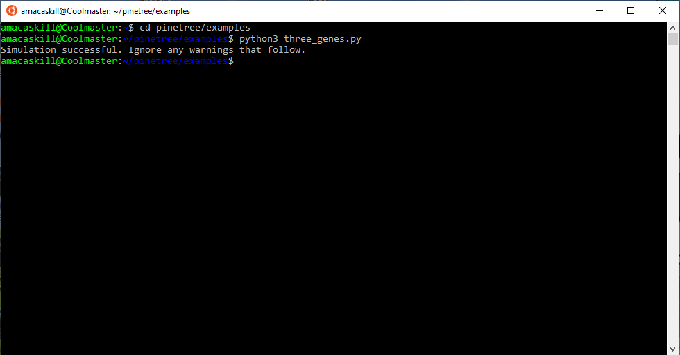

## Running a Toy Model in Pinetree
This tutorial aims to walk you through the procedure for runnning a pinetree simulation using a simplified genome.
1. Boot up your terminal (Terminal for Macs or Ubuntu for Windows)
2. Run the following command:
```sh
git clone https://github.com/clauswilke/pinetree.git
```
3. Set working directory to the examples folder using: 
```sh
cd pinetree/examples
```
4. Run the test script three_genes.py using:
```sh
python3 three_genes.py
```
5. The terminal should finish quickly, and look like this:


6. This script will create an output file named “three_genes_counts.tsv” in the same folder the script was run from.
   - For Windows users utilizing the ubuntu terminal, you will have to navigate to the Windows Subsystem for Linux network drive.
   - The easiest way to do this is to create a new desktop shortcut by right clicking on your desktop, choosing **New** and selecting **Shortcut** from the dropdown. Type in **\\\wsl$** into the box asking for the location of the item.
   - From this shortcut, navigate to **Ubuntu-20.04>home>your_username>pinetree>examples**
7. You can now access the data generated by your script! Next, we will look at an example of how to visualize this data.
## Visualizing Pinetree Data in R
Now that you've generated a dataset, lets try a simple example of how to display it.  
For this step, you will require some additional programs:
  - R, a programming language designed for data analysis. You can download R through one of the links [here.](https://cran.r-project.org/mirrors.html)
  - RStudio, an IDE that makes coding with R much more user-friendly. [Download Here](https://rstudio.com/products/rstudio/download/#download)
1. First, find the script **"time_course.R"** in this repository. It should be under **igem2020/T7-simulation/scripts.**
   -This script creates a graph of the concentrations of various proteins during the course of a T7 bacteriophage infection. We will be adapting it for use in this toy model.
2. Open **"time_course.R"** using RStudio
3. On line 4, which reads `cts = read_tsv("example_output_phage_counts.tsv")`
